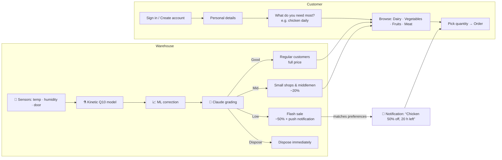

# ❄️ FreshRoute — AI Cold-Chain Monitoring & Food-Loss Reduction

**Rebootathon · Challenge 2: AI for Cold-Chain Monitoring and Food-Loss Reduction**

In Qatar's hot climate and import-dependent food system, a single warm hour in a reefer truck or a chiller door left open can take days off the shelf life of fresh food. FreshRoute is a web platform that:

1. **Streams sensor data** (temperature, humidity, door state) from cold rooms and reefer trucks.
2. **Recalculates the shelf life of every batch** with a **hybrid AI model**: a physics-based kinetic model corrected by machine learning.
3. **Grades every batch with an LLM (Claude)** as **Good · Mid · Low · Dispose**.
4. **Routes the food to the right buyer**: regular customers, small shops and middlemen, discounted flash sales, or disposal. It also sends customers notifications that match what they need.

It has two sides:

| Side | Who | What they do |
|---|---|---|
| 🛒 **Customer app** | Restaurants, households, shops/middlemen | Sign up, set "what I need most", browse Dairy / Vegetables / Fruits / Meat, order, and get notified about limited stock and flash deals |
| 🏭 **Warehouse manager dashboard** | Cold-store operators | Live sensors, alerts with one-click actions, batch shelf-life predictions, the AI pipeline, and routing |

---

## 🚀 How to run

### Requirements
- **Node.js 18 or newer** (check with `node --version`). Download it from https://nodejs.org if you don't have it.
- No database to install. State is saved to `data/db.json` automatically.

### Steps

```bash
# 1. go into the project folder
cd reboothackathon

# 2. install dependencies (express + the Anthropic SDK)
npm install

# 3. start the server
npm start
```

Open **http://localhost:3000** in your browser.

To start again from clean demo data at any time:

```bash
npm run reset      # starts the server with fresh data
```

You can also click **↺ Reset demo data** at the bottom of the manager sidebar.

### Turn on the Claude LLM grading (optional but recommended)

The app works fully offline with a rule-based fallback. To use Claude for the grading step, set an Anthropic API key before starting:

**Windows (PowerShell)**
```powershell
$env:ANTHROPIC_API_KEY = "sk-ant-..."
npm start
```

**macOS / Linux**
```bash
export ANTHROPIC_API_KEY="sk-ant-..."
npm start
```

The console prints `Claude grading: ON (claude-opus-5)` when it is active.

### Demo accounts

| Role | Email | Password |
|---|---|---|
| 🏭 Warehouse manager | `manager@example.com` | `manager123` |
| 🍽️ Restaurant (needs chicken & tomatoes daily) | `chef@example.com` | `demo123` |
| 🏠 Household (strawberries, milk) | `sara@example.com` | `demo123` |
| 🏪 Shop / middleman (sees wholesale "mid" lots) | `shop@example.com` | `demo123` |

The login page has buttons that fill these in. To create a new **manager** account, use the access code **`COLDCHAIN`**.

### Configuration (environment variables, all optional)

| Variable | Default | Meaning |
|---|---|---|
| `PORT` | `3000` | Web server port |
| `ANTHROPIC_API_KEY` | — | Enables Claude grading |
| `CLAUDE_MODEL` | `claude-opus-5` | Claude model used for grading |
| `TICK_MS` | `5000` | Real milliseconds between sensor readings |
| `SIM_MINUTES_PER_TICK` | `10` | Simulated minutes per reading (time runs faster so you can watch food age) |
| `AI_EVERY_TICKS` | `36` | How often Claude re-grades automatically (every 3 minutes by default) |
| `INGEST_KEY` | `demo-ingest-key` | API key real sensors use to push data |
| `MANAGER_CODE` | `COLDCHAIN` | Access code for manager sign-up |

---

## 🎬 Suggested 3-minute demo

1. **Sign in as the manager.** The Overview shows KPIs, the live 5-step AI pipeline, where stock is going, the most urgent batches and live sensors.
2. **About 40 seconds in, reefer truck QTR-07 loses its compressor** (a scripted incident). Its sparkline turns red and a **critical "High temperature" alert** appears with the recommendation *"Reroute to the nearest cold store"*.
3. Click **🚚 Reroute**. The truck is unloaded into the right chillers and the alert resolves. If you wait instead, the lamb and yogurt on board build up "hours above safe temperature" and get **disposed automatically**.
4. Open **Batches** and click a row. You'll see the model breakdown: kinetic estimate, then ML correction factor, then the prediction at current conditions, plus the grade, the reason and the action.
5. Open **AI pipeline** and click **Run AI grading now**. Claude re-grades every batch and each one shows `🧠 Claude` as its source.
6. Open **Sensors → Simulate an incident** to trigger a door-open or humidifier failure in any room and watch the pipeline react.
7. **Sign out and sign in as `chef@example.com`.** The 🔔 bell has notifications such as *"🔥 Fresh chicken breast — 50% off, best within 30 h"* and *"✅ Your daily fresh chicken breast is in stock"*. Order some from the **For you** tab.
8. **Sign in as `shop@example.com`.** Shops also see **🏷️ Wholesale lots (−20%)**, which are the "mid" grade batches.

---

## 🧭 The workflow



### Customer journey (screen by screen)

| # | Screen | What's on it |
|---|---|---|
| 1 | **Sign in / Create account** | Email + password. Demo-account shortcuts. |
| 2 | **Create account: Your details** | Account type (Restaurant, Household, Shop/middleman, Warehouse manager), name, phone, email, password, business name, area. |
| 3 | **Create account: What you need** | Products grouped by category. Tap to select, then set **how often** (daily / weekly / occasionally) and **usual quantity**. |
| 4 | **Shop** | Category tabs: **For you, Meat & Poultry, Dairy, Vegetables, Fruits**. Each product card shows its offers: **Fresh** (full price), **🏷️ Wholesale −20%** (shops only), **🔥 Flash deal −50%** (with a "use within X h" label). Quantity stepper + **Order**. |
| 5 | **Deals** | Every flash / wholesale offer, most urgent first. |
| 6 | **My orders** | Order history with prices. |
| 7 | **My needs** | Edit preferences at any time. |
| 🔔 | **Notifications** | In-app bell, pop-up toasts, and optional browser/desktop notifications. |

**When customers get notified** (only for products in their preferences):
- 🔥 a batch becomes **Low** grade: flash deal, with the hours left
- ✅ a **daily** item is in fresh stock today
- ⚠️ fresh stock is **limited** (low stock)
- 🏷️ (shops) a **Mid** grade wholesale lot is available

### Warehouse manager dashboard

| Page | What's on it |
|---|---|
| **Overview** | KPI tiles (stock, at-risk kg, kg rescued from waste, kg disposed, open alerts, temperature compliance), the live pipeline diagram, kg per grade and where it's routed, a "most urgent batches" chart, open alerts, sensor cards with sparklines, and an activity feed |
| **Sensors** | Temperature chart (with setpoint and alert threshold) and humidity chart for any chiller or truck, what's stored there, and **incident simulation** buttons |
| **Batches** | Every batch: location, quantity, **shelf life left ± uncertainty**, **risk score /100**, **AI grade + source**, reason and recommended action. Filters and search. Actions: 🔍 inspect, 🔥 move to flash sale, 🤝 donate, 🗑️ dispose. Click a row for the full model breakdown. |
| **Alerts** | Auto-detected cold-chain problems, each with a recommendation and one-click actions (**Reroute**, **Fix / adjust**, **Inspect**, **Donate**, **Flash sale**, **Acknowledge**) |
| **AI pipeline** | How the model works, the learned ML weights, Claude status, a **Run AI grading now** button and the run history |

---

## 🧠 How the AI works

### Step 1 · Sensor pipeline
Every location (4 cold rooms and 2 reefer trucks) has a sensor. In the demo a simulator produces realistic readings, including scripted and random incidents. **Real IoT gateways can push readings instead**. When a sensor pushes data, the simulator stops simulating it:

```bash
curl -X POST http://localhost:3000/api/ingest \
  -H "Content-Type: application/json" -H "x-api-key: demo-ingest-key" \
  -d '[{"sensorId":"S-01","temp":3.4,"rh":87,"door":false}]'
```

Sensor IDs: `S-01` Meat chiller · `S-02` Dairy chiller · `S-03` Produce room · `S-04` Tropical room · `S-05` Truck QTR-12 · `S-06` Truck QTR-07.

### Step 2 · Hybrid shelf-life model ([server/model.js](server/model.js))

**a) Kinetic (physics) model.** Each product has a base shelf life at its ideal temperature, a Q10 value and a safe humidity range ([server/catalog.js](server/catalog.js)). Every reading uses up shelf life at:

```
rate = Q10 ^ ((T − T_ideal) / 10)   × humidity penalty   (× chill-injury penalty for tropical produce)
life_used += rate × hours
```

For example, chicken (Q10 ≈ 3.2) stored at 11 °C instead of 1 °C ages **3.2× faster**.

**b) Machine-learning correction.** Real shelf life also depends on handling history. A **ridge regression** learns a correction factor from historical batch outcomes, using these features:
- degree-hours above ideal
- hours above the food-safety limit
- average humidity deviation
- number of handling events
- days in transit

It reaches **R² ≈ 0.96** on held-out data. In production the training data would be QA inspection records (predicted vs. actual end of life). *In this demo the 1,200 historical records are synthetic*, generated from a hidden ground-truth relationship plus noise.

**c) Output per batch:** remaining hours **at current conditions** ± uncertainty, fraction of life left, a **spoilage-risk score (0–100)**, and a deterministic **rule grade** used as a safety baseline.

### Step 3 · LLM grading ([server/classifier.js](server/classifier.js))
All active batches go to **Claude** in one request, as structured JSON (remaining hours, risk, abuse hours, temperatures, location, rule grade). Claude returns a **grade, a reason and a practical action** for each batch using **structured outputs** (a JSON schema), so the response always parses. It runs at startup, every ~3 minutes, and on demand.

| Grade | Meaning | Route |
|---|---|---|
| ✓ **Good** | Plenty of life, no safety issue | Regular customers (standing orders), full price |
| ◐ **Mid** | Noticeably reduced life but several days left | Small shops & middlemen, −20% |
| ! **Low** | Must be eaten within ~48 h | Flash sale to instant consumers, −50%, push notifications |
| ✕ **Dispose** | < 6 h left or a food-safety breach (high-risk food above its safe temperature for ≥ 4 h) | Removed from sale immediately |

**Safety guardrails**
- The LLM can **never** keep a batch on sale that the hard food-safety rules say must be disposed.
- If a batch's condition gets worse after Claude graded it, the rules take over until the next Claude run.
- Without an API key, or if the call fails, the rule-based grade and explanation are used, so the app never breaks.
- Donation is only allowed when there is no food-safety breach.

### Step 4 · Alerts & recommended actions
| Detected issue | Recommended action (one click) |
|---|---|
| Truck temperature > setpoint + 3 °C | **Reroute** to the nearest cold store and unload into the right chillers |
| Room temperature too high | **Fix / adjust** (technician), inspect |
| Door open / humidity out of range | **Adjust** |
| High-risk food building up hours above its safe temperature | **Inspect**, move to **flash sale** |
| Low-grade batch with < 24 h left and unsold | **Donate** to a food-rescue partner |
| Batch disposed | Acknowledge and log the root cause |

---

## 🗂️ Project structure

```
reboothackathon/
├── package.json
├── server/
│   ├── index.js        # Express API, auth, sensor simulator, alerts, routing, notifications
│   ├── catalog.js      # Products (Q10, ideal temp, safe temp, humidity), locations, routing rules
│   ├── model.js        # Hybrid shelf-life model: kinetic + ridge-regression correction + risk
│   └── classifier.js   # Claude grading (structured outputs) + rule-based fallback
├── public/
│   ├── index.html      # Single-page app shell (Chart.js from CDN)
│   ├── app.js          # All screens: auth, sign-up, shop, notifications, manager dashboard
│   └── styles.css      # Design system, light + dark mode, responsive
└── data/db.json        # Auto-created saved state (git-ignored)
```

### API reference

| Method | Path | Who | Purpose |
|---|---|---|---|
| POST | `/api/auth/signup` | anyone | Create an account (details + preferences) |
| POST | `/api/auth/login` | anyone | Sign in and get a bearer token |
| GET | `/api/me` · PUT `/api/me/prefs` | signed in | Profile / update "what I need" |
| GET | `/api/catalog` | customer | Products with offers per grade tier |
| POST | `/api/orders` · GET `/api/orders` | customer | Place an order (first-expired-first-out allocation) / list orders |
| GET | `/api/notifications` · POST `/api/notifications/read` | signed in | Notifications |
| GET | `/api/manager/overview` | manager | Everything the dashboard shows |
| POST | `/api/manager/ai/run` | manager | Run LLM grading now |
| POST | `/api/manager/alerts/:id/action` | manager | `reroute` · `adjust` · `inspect` · `donate` · `prioritize` · `ack` |
| POST | `/api/manager/batches/:id/action` | manager | `inspect` · `prioritize` · `donate` · `dispose` |
| POST | `/api/manager/sensors/:id/fault` | manager | Demo: inject `compressor` / `door` / `humidifier` fault (or `null` to clear) |
| POST | `/api/ingest` | sensor gateway | Push real sensor readings (`x-api-key` header) |
| GET | `/api/health` | anyone | Health check |

---

## ⚠️ Limitations (hackathon scope)
- Sensor data is simulated unless you push real readings to `/api/ingest`. Simulated time runs 120× faster than real time by default (10 simulated minutes every 5 seconds).
- The ML correction is trained on synthetic history. Swap in real inspection records to use it for real.
- Payments and delivery logistics are out of scope. Orders are confirmed instantly.
- Passwords are hashed with scrypt, but sessions are simple bearer tokens and state is kept in a JSON file. Use a real database and auth provider in production.
