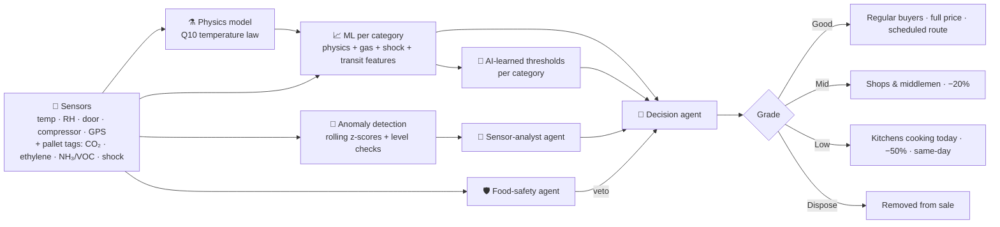

# 🛟 ResQChain — AI Cold-Chain Monitoring & Food-Loss Reduction

**Rebootathon · Challenge 2: AI for Cold-Chain Monitoring and Food-Loss Reduction**

In Qatar's hot climate and import-dependent food system, a single warm hour in a reefer truck or a chiller door left open can take days off the shelf life of fresh food. Temperature logs alone can't tell whether a batch is *actually* spoiling, so good food is thrown away and bad food is sold as fresh.

**ResQChain is the B2B platform of a cold store / food distributor.** It:

1. **Reads many sensors, not just temperature:** temperature, humidity, doors, reefer compressor, GPS, and a **freshness tag on every pallet** measuring **CO₂, ethylene, ammonia/VOC and shock**.
2. **Predicts remaining shelf life with a hybrid AI:** a physics model plus machine learning trained on historical outcomes. **The AI learns the Good / Mid / Low / Dispose thresholds itself**, for each product category.
3. **Uses a team of three LLM agents** (via OpenRouter, model `nvidia/nemotron-3-ultra-550b-a55b:free`) (sensor analyst, food safety, decision) to explain the evidence and make the final call.
4. **Sells and delivers each batch to the business that can still use it in time**, raises alerts with one-click actions, and notifies buyers automatically.

---

## 📡 1. Which sensors, and why

Temperature and humidity IoT monitoring is already standard in Qatar's cold chain. Local providers such as [Infotech Qatar](https://infotech.qa/services/iot/cold-chain-management/) and [iSense](https://isenseonline.com/) supply sensors for warehouses and reefer trucks, and cold-chain facilities have had to follow strict temperature-control regulations since 2023 ([Ken Research](https://www.kenresearch.com/qatar-cold-chain-smart-warehouse-robotics-automation-market)). ResQChain adds gas and shock sensing on each pallet, because gases come **from the food itself**. Research shows ammonia, hydrogen sulfide and trimethylamine are early spoilage markers for meat and fish, and ethylene indicates ripeness and remaining shelf life of fruit ([PMC review](https://pmc.ncbi.nlm.nih.gov/articles/PMC12346065/), [ScienceDirect](https://www.sciencedirect.com/science/article/pii/S2666154326001201)).

| Sensor | Where | What it tells the AI | Status in the market |
|---|---|---|---|
| 🌡️ Temperature | Rooms, trucks, pallet tags | How fast the food ages (Q10 law) | Standard |
| 💧 Relative humidity | Rooms, trucks, pallet tags | Wilting / drying of produce, mould risk | Standard |
| 🚪 Door open/close | Rooms | Warm-air spikes | Standard |
| ⚙️ Reefer compressor status | Trucks | Catches a failing fridge **before** the temperature rises | Standard on modern reefer units |
| 📍 GPS / ETA | Trucks | Location, time in transit, delays | Standard |
| 📳 Shock | Pallet tags | Rough handling → bruised soft produce | Common |
| 🍌 Ethylene | Pallet tags | Ripening of climacteric fruit (tomato, mango, banana) | Advanced |
| 🫧 CO₂ | Pallet tags | Respiration / microbial growth in produce | Advanced |
| 🐟 Ammonia / VOC ("e-nose") | Pallet tags | Protein spoilage in meat, fish, dairy, often before any visible sign | Advanced / pilots |

Each product has its own **key signal** ([server/catalog.js](server/catalog.js)): ammonia/VOC for meat, fish and dairy; ethylene for climacteric fruit; CO₂ for leafy greens and berries.

## 🔄 2. Data flow: who enters what, who manages it

Sensor readings are **never typed in**. People only add what a machine can't know. This mirrors how Qatari cold stores already work:
- Qatar's Ministry of Public Health (MoPH) inspects imported food at Hamad Port, Hamad Airport, Al Ruwais and Abu Samra. Fresh food is usually cleared within 24 hours ([Qatar Tribune](https://www.qatar-tribune.com/article/132308/latest-news/60520-imported-food-shipments-checked-in-h1-2024-moph), [Wikipedia](https://en.wikipedia.org/wiki/Food_safety_in_Qatar)).
- Pallets carry GS1 barcodes (Qatar's prefix is 630). They are checked against the delivery paperwork and recorded in the warehouse management system (WMS) on arrival ([GS1 Qatar](https://qatarexports.qdb.qa/en/export-development/gs1-qatar-office), [GS1 traceability guideline](https://www.gs1.org/standards/fresh-fruit-and-vegetable-traceability-guideline/current-standard)).

| # | Data | Entered by | In the app |
|---|---|---|---|
| 1 | **Advance Shipping Notice (ASN):** product GTIN, lot, pallet SSCC, origin, harvest date, qty | Supplier / forwarder, electronically | ⚡ Automatic. Each inbound truck carries an ASN. |
| 2 | **MoPH port-health clearance** | MoPH inspectors at Hamad Port / Abu Samra | ⚡ Automatic. "✓ Cleared" on the shipment. |
| 3 | **Reefer telemetry:** temperature, humidity, compressor, GPS | Truck sensors | ⚡ Automatic, live |
| 4 | **Dock receiving:** scan SSCC against the ASN, probe core temperature, condition, accept / reject | 👤 **Receiving clerk** | **Receiving** screen |
| 5 | **Storage sensors + pallet freshness tags** | Sensors | ⚡ Automatic, live |
| 6 | **QA inspection:** sensory score 1–5, probe temperature, notes. Also a training label for the AI. | 👤 **QA inspector** | "Log QA inspection" in a batch |
| 7 | **Decisions:** approve reroute, flash sale, donation | 👤 **Warehouse manager** (food-safety officer has the final say on disposal) | Alerts & batch actions |

Real sensors and gateways can push data to `POST /api/ingest` (see [API](#-api-reference)).

## 🧠 3. How the AI decides Good / Mid / Low / Dispose



**Layer 1: hybrid machine learning** ([server/model.js](server/model.js))
- **Physics model:** every reading uses up shelf life at `rate = Q10^((T − T_ideal)/10)`, plus humidity and chill-injury penalties. It only knows storage conditions.
- **ML model (ridge regression, one per category):** predicts real remaining shelf life from the physics estimate plus:
  - **gas features:** how "old" the key gas says the food is, a second gas, and the gas trend
  - shocks, temperature abuse, humidity stress, transit time and handling
- **Why the gas matters:** in the (simulated) real world, about 20% of batches age faster than their temperature history explains (poor pre-cooling, contamination, bruising). Only the gas sensors can see this.
- **AI-learned thresholds:** for each category the AI chooses the cut-offs on *its own predictions* that best reproduce historical outcomes. Grading food as better than it really is counts **4× worse** than the opposite, so less certain categories automatically get safer thresholds. The dashboard shows the learned thresholds, and the grading accuracy **temperature-only vs all sensors**:
  - meat: 73% → 93%
  - vegetables: 77% → 94%
  - fruits: 73% → 85%
  - dairy: 84% → 86%
- **Anomaly detection:** a rolling z-score on every sensor stream, plus level checks (for example, gas near spoilage level, or recent shocks).

**Layer 2: three LLM agents on OpenRouter** ([server/agents.js](server/agents.js)). Each run sends all batches to `nvidia/nemotron-3-ultra-550b-a55b:free` and asks for JSON in a fixed shape (strict JSON-schema mode when the provider supports it). Every answer is validated, and invalid entries are dropped. The analyst and safety agents run in parallel, and the decision agent runs after them.

| Agent | Reads | Returns |
|---|---|---|
| 🔬 **Sensor analyst** | All current readings, 1-hour changes, fresh baselines, anomalies, gas-age vs physics estimate | Concern level + what is physically happening (e.g. *"ammonia says 73% of life used vs 42% by temperature — ageing faster than expected"*) |
| 🛡️ **Food safety** | Abuse hours, max temperature, ammonia/VOC, probe temperature at receipt, QA inspection | safe / caution / **unsafe (veto)**, the rule applied, whether donation is allowed |
| 🚚 **Decision** | ML prediction ± uncertainty, learned thresholds, both agents' findings | Final grade, reason, practical action, confidence |

**Guardrails no model can override:**
- A safety veto means dispose.
- A QA sensory score of 3/5 caps the grade at Low.
- A score of 1–2/5 is a veto.
- Only the ML or the safety agent can send a batch to Dispose.

Without an API key (or if a call fails), deterministic versions of the three agents run instead, so the app always works. The LLM runs at start-up, every ~3 minutes, and on demand ("🧠 Run AI agents now").

---

## 🚀 How to run

**Requirements:** Node.js 18+ (`node --version`). No database needed; state is saved to `data/db.json`.

```bash
cd reboothackathon
npm install
npm start          # → http://localhost:3000
npm run reset      # start again with fresh demo data
```

**Turn on the LLM agents (recommended):** the agents run on **OpenRouter** with the free model `nvidia/nemotron-3-ultra-550b-a55b:free`.
1. Create a free account at https://openrouter.ai.
2. Create an API key (Settings → Keys).
3. Set it before starting:

```powershell
# Windows PowerShell
$env:OPENROUTER_API_KEY = "sk-or-..."
npm start
```
```bash
# macOS / Linux
export OPENROUTER_API_KEY="sk-or-..."
npm start
```

The console shows `LLM agents (OpenRouter): ON (nvidia/nemotron-3-ultra-550b-a55b:free)`, plus the learned accuracy per category.

About the free model:
- Free models are rate-limited. ResQChain retries once after a rate limit, and if the call still fails it keeps the rule-based agents for that run. The error is shown in the AI-run toast.
- If you hit limits often, raise `AI_EVERY_TICKS`, for example to `120`.
- If the model doesn't support strict JSON mode, ResQChain automatically switches to plain JSON prompting and validates every answer.

### Demo accounts

| Role | Email | Password |
|---|---|---|
| 🏭 Warehouse manager | `manager@example.com` | `manager123` |
| 🍽️ Restaurant: Corniche Grill | `chef@example.com` | `demo123` |
| 🏨 Hotel kitchen: Pearl Bay Hotel | `hotel@example.com` | `demo123` |
| 🏪 Shop / middleman: Al Rayyan Mini Mart | `shop@example.com` | `demo123` |

The manager sign-up access code is **`COLDCHAIN`**. You can deep-link to a screen, e.g. `http://localhost:3000/#receiving` or `#batches/B-1026`.

### Configuration (all optional)

| Variable | Default | Meaning |
|---|---|---|
| `PORT` | `3000` | Web server port |
| `OPENROUTER_API_KEY` | — | Enables the LLM agents (OpenRouter) |
| `OPENROUTER_MODEL` | `nvidia/nemotron-3-ultra-550b-a55b:free` | OpenRouter model used by the agents |
| `TICK_MS` | `5000` | Real milliseconds between sensor readings |
| `SIM_MINUTES_PER_TICK` | `10` | Simulated minutes per reading |
| `AI_EVERY_TICKS` | `36` | Automatic LLM run interval (~3 min) |
| `INGEST_KEY` | `demo-ingest-key` | API key for real sensors |
| `MANAGER_CODE` | `COLDCHAIN` | Manager sign-up code |

---

## 🎭 Pitch role-play (the main demo)

One story: **something went wrong → ResQChain explains the impact → finds the best destination → the buyer actually needs it → food is saved.** All numbers in this flow are fixed prototype / simulated outputs ([server/story.js](server/story.js)), so every run is identical.

**👩‍💼 Warehouse manager** (`manager@example.com`) opens on **🚨 Action required**:
1. **Detect:** 500 kg strawberries · 2.3 days usable life left · temperature excursion · risk HIGH.
2. **Explain** ("Why is it at risk?"): factor bars (temperature / transit delay / shock / humidity), the AI explanation, ML prediction 2.3 days at 87% confidence, and the three agents.
3. **Simulate** ("What happens if I do nothing?"): keep route 38% waste · reroute 12% · reroute + discount 7% → **155 kg saved**.
4. **Decide:** optimal route 300 kg → Retailer B · 150 kg → Corniche Grill · 50 kg → short-life channel → **SAVE THIS SHIPMENT**.

**👩‍🍳 Restaurant buyer** (`chef@example.com`, needs chicken daily and strawberries weekly), in a second browser/phone:
5. A 🔔 **"New inventory matches your needs"** alert appears on **🎯 For you**, with strawberries under *Recommended for you*: 150 kg · 2.3 days · 20% off · 🟢 matches your weekly demand.
6. **Buy now** → strawberries · 150 kg · 20% off · delivery today → **ORDER** → ✅ confirmed · 🚚 scheduled · 🌡️ cold-chain monitored.

**Both:** the manager's screen shows **500 kg → 0 kg waste**. Use **↺ Restart demo** to run it again.

The rest of the platform (control room, receiving, batches, live sensors, ML accuracy) is under **More**.

## 🎬 Full platform tour (under "More")

1. **Sign in as the manager, open More.** The **Control room** shows:
   - the pipeline (Sensors → Anomaly detection → Hybrid ML → 3 LLM agents → Routing)
   - the key numbers
   - live sensors and alerts
   - **What the AI learned**: thresholds per category and the accuracy gain from the gas sensors
2. **"AI detected early spoilage — Chilled lamb leg".** Its temperature history is perfect (temperature-only model says *Good*), but the pallet's **ammonia sensor** shows it is ageing fast. Click **🔍 Inspect**.
3. **In the batch detail you see:**
   - ① six sensor charts with the key gas highlighted
   - ② the ML prediction on the AI-learned threshold scale vs the temperature-only estimate
   - ③ the three agents' findings

   Log a QA inspection (e.g. sensory 3/5) and watch the grade update.
4. **~40 s in, reefer truck QTR-07 reports a compressor fault** before its temperature has even risen. Click **🚚 Reroute**. The truck goes to the dock on shore power.
5. **Open Receiving:**
   - The ASN, MoPH clearance and GPS came in automatically.
   - **Scan** the pallets, enter probe temperatures, set condition, then **Confirm receipt**.
   - The pallets are put away into the right chillers and their tags keep reporting.
6. Click **🧠 Run AI agents now** (with an API key, the source becomes `🧠 LLM agents`).
7. **Sign in as `chef@example.com`:** flash deals with same-day delivery, notifications for daily items, orders with **Confirmed → Out for delivery → Delivered**.
8. **Sign in as `shop@example.com`:** the shop sees 🏷️ wholesale lots (Mid grade) instead of flash deals.

---

## 💼 Business model: grade → buyer → delivery

| Grade | Who buys it | Price | Delivery |
|---|---|---|---|
| ✓ **Good** | Restaurants, hotels, supermarkets | Full price | 🚚 Next scheduled reefer route (06:00) |
| ◐ **Mid** | Small shops (baqalas) & middlemen | −20% | 🚚 Next scheduled route |
| ! **Low** | Restaurant & hotel kitchens cooking it today | −50% flash deal | ⚡ Same-day express van |
| ✕ **Dispose** | — | — | Removed; donated only if the safety agent allows |

Business buyers only, minimum order 5 kg / L:
- Restaurants and hotels see fresh stock + flash deals.
- Shops see fresh stock + wholesale lots.
- Supermarkets see fresh stock only.

## 🖥️ Screens

| App | Screen | Contents |
|---|---|---|
| Customer | **Sign in / Create account** | Business type & details → "what do you need most" (product, frequency, usual qty) |
| Customer | **🛒 Shop** | Flash-deal (or wholesale) banner, category tabs, offers with delivery time, order |
| Customer | **📦 My orders** · 🔔 | Delivery status; notifications for their products |
| Manager | **📊 Control room** | Pipeline, key numbers, live sensors + incident simulator, alerts with actions, what the AI learned, where stock is going |
| Manager | **🚚 Receiving** | Data-flow map, trucks with ASN / MoPH clearance / telemetry, dock receiving (scan, probe, condition) |
| Manager | **📦 Batches** | Every batch's AI prediction, grade, reason and destination. Detail: sensor charts, threshold scale, agents, traceability, QA inspection form. |

---

## 🗂️ Project structure

```
reboothackathon/
├── server/
│   ├── index.js     # API, data flow (ASN → receiving → storage), simulator, alerts, routing, orders, notifications
│   ├── catalog.js   # Products (Q10, safe temps, gas profiles, GS1 GTINs), locations, outcome windows, routes
│   ├── model.js     # Physics model, pallet-tag gas physics, hybrid ML, learned thresholds, anomaly detection
│   └── agents.js    # 3 LLM agents via OpenRouter (validated JSON) + deterministic fallbacks
├── public/          # index.html, app.js (all screens), styles.css
└── data/db.json     # auto-created saved state (git-ignored)
```

## 🔌 API reference

| Method | Path | Who | Purpose |
|---|---|---|---|
| POST | `/api/auth/signup` · `/api/auth/login` | anyone | Accounts |
| GET | `/api/catalog` | customer | Offers for this business type, with delivery plan |
| POST / GET | `/api/orders` | customer | Order (min 5, first-expired-first-out) / list with delivery status |
| GET / POST | `/api/notifications`, `/api/notifications/read` | signed in | Notifications |
| GET | `/api/manager/overview` | manager | Dashboard data |
| GET | `/api/manager/batches/:id` | manager | Batch detail incl. pallet-tag history |
| POST | `/api/manager/receiving/:truckId` | manager | Dock receiving `{ lines: [{ batchId, probeTemp, condition, accept }] }` |
| POST | `/api/manager/batches/:id/inspection` | manager | QA inspection `{ sensory: 1-5, probeTemp, notes }` |
| POST | `/api/manager/ai/run` | manager | Run the LLM agents now |
| POST | `/api/manager/alerts/:id/action` | manager | `reroute` · `adjust` · `donate` · `prioritize` · `ack` |
| POST | `/api/manager/batches/:id/action` | manager | `prioritize` · `donate` · `dispose` |
| POST | `/api/manager/sensors/:id/fault` | manager | Demo: `compressor` / `door` / `humidifier` / `null` |
| POST | `/api/ingest` | sensor gateway (`x-api-key`) | Location sensor `{ sensorId, temp, rh, door }` or pallet tag `{ batchId, co2, eth, voc }` |

```bash
curl -X POST http://localhost:3000/api/ingest -H "Content-Type: application/json" -H "x-api-key: demo-ingest-key" \
  -d '[{"sensorId":"S-01","temp":3.4,"rh":87},{"batchId":"B-1003","co2":950,"eth":0.05,"voc":6.2}]'
```

---

## ⚠️ Limitations (hackathon scope)
- **All sensor data is simulated** unless pushed to `/api/ingest`. Time runs 120× faster than real time by default.
- **The ML is trained on 1,760 simulated batch histories.** They are generated from the same physics plus hidden per-batch effects, not real inspection records. In production, QA inspections (already logged by the app) would be the training labels. The accuracy numbers show the method, not field performance.
- Per-pallet gas tags are an advanced / emerging technology; most Qatari facilities today have temperature and humidity only.
- Delivery is a schedule (next 06:00 route, or express within 3 h), with no route optimisation. Payment is out of scope.
- Sessions are simple bearer tokens and state is a JSON file. Use a real database and auth in production.
