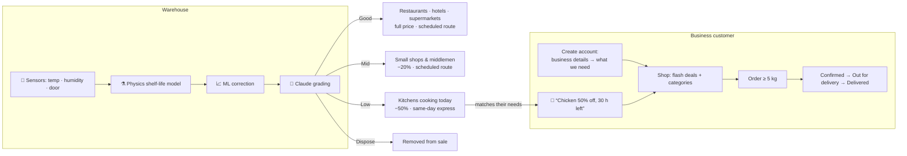

# ❄️ FreshRoute — AI Cold-Chain Monitoring & Food-Loss Reduction

**Rebootathon · Challenge 2: AI for Cold-Chain Monitoring and Food-Loss Reduction**

In Qatar's hot climate and import-dependent food system, a single warm hour in a reefer truck or a chiller door left open can take days off the shelf life of fresh food. The food is still sold at full price, to buyers who expect a week of freshness, until it spoils and is thrown away.

**FreshRoute is the B2B platform of a cold store / food distributor.** It:

1. **Streams sensor data** (temperature, humidity, door state) from cold rooms and reefer trucks.
2. **Recalculates the shelf life of every batch** with a **hybrid AI model**: a physics-based kinetic model corrected by machine learning.
3. **Grades every batch with an LLM (Claude)** as **Good · Mid · Low · Dispose**.
4. **Sells and delivers each batch to the business that can still use it in time**, and notifies those businesses automatically.

## 💡 The business model: who buys what, and how it's delivered

A warehouse doesn't sell 2 kg of strawberries to a household. It sells **in bulk to businesses** and delivers on **refrigerated routes**. The AI grade decides *which kind of business* a batch goes to:

| AI grade | Shelf life | Who buys it | Price | Delivery |
|---|---|---|---|---|
| ✓ **Good** | Plenty left | **Regular buyers**: restaurants, hotels, supermarkets | Full price | 🚚 Next **scheduled reefer route** (06:00 daily) |
| ◐ **Mid** | Reduced, but several days left | **Small shops (baqalas) & middlemen**, who resell fast | −20% wholesale | 🚚 Next scheduled reefer route |
| ! **Low** | Must be used within ~48 h | **Restaurants & hotel kitchens cooking it today** | −50% flash deal | ⚡ **Same-day express van** |
| ✕ **Dispose** | Unsafe or expired | Nobody | — | Removed from sale; donated only if still safe |

Consumers are reached through the shops, restaurants and hotels. FreshRoute itself only sells to businesses, with a **minimum order of 5 kg / L**.

| Business type | Sees |
|---|---|
| 🍽️ Restaurant / café, 🏨 Hotel / caterer | Fresh stock + 🔥 flash deals |
| 🏪 Small shop / middleman | Fresh stock + 🏷️ wholesale lots |
| 🛒 Supermarket | Fresh stock only |

---

## 🚀 How to run

### Requirements
- **Node.js 18 or newer** (check with `node --version`). Download it from https://nodejs.org if you don't have it.
- No database to install. State is saved to `data/db.json` automatically.

### Steps

```bash
# 1. go into the project folder
cd reboothackathon

# 2. install dependencies (express + the Anthropic SDK)
npm install

# 3. start the server
npm start
```

Open **http://localhost:3000** in your browser.

To start again from clean demo data at any time:

```bash
npm run reset      # starts the server with fresh data
```

You can also click **↺ Reset demo data** at the bottom of the manager's control room.

### Turn on the Claude LLM grading (optional but recommended)

The app works fully offline with a rule-based fallback. To use Claude for the grading step, set an Anthropic API key before starting:

**Windows (PowerShell)**
```powershell
$env:ANTHROPIC_API_KEY = "sk-ant-..."
npm start
```

**macOS / Linux**
```bash
export ANTHROPIC_API_KEY="sk-ant-..."
npm start
```

The console prints `Claude grading: ON (claude-opus-5)` when it is active.

### Demo accounts

| Role | Email | Password |
|---|---|---|
| 🏭 Warehouse manager | `manager@example.com` | `manager123` |
| 🍽️ Restaurant: Corniche Grill (needs chicken & tomatoes daily) | `chef@example.com` | `demo123` |
| 🏨 Hotel kitchen: Pearl Bay Hotel (milk & strawberries daily) | `hotel@example.com` | `demo123` |
| 🏪 Shop / middleman: Al Rayyan Mini Mart (sees wholesale lots) | `shop@example.com` | `demo123` |

The login page has buttons that fill these in. To create a new **manager** account, use the access code **`COLDCHAIN`**.

### Configuration (environment variables, all optional)

| Variable | Default | Meaning |
|---|---|---|
| `PORT` | `3000` | Web server port |
| `ANTHROPIC_API_KEY` | — | Enables Claude grading |
| `CLAUDE_MODEL` | `claude-opus-5` | Claude model used for grading |
| `TICK_MS` | `5000` | Real milliseconds between sensor readings |
| `SIM_MINUTES_PER_TICK` | `10` | Simulated minutes per reading (time runs faster so you can watch food age) |
| `AI_EVERY_TICKS` | `36` | How often Claude re-grades automatically (every 3 minutes by default) |
| `INGEST_KEY` | `demo-ingest-key` | API key real sensors use to push data |
| `MANAGER_CODE` | `COLDCHAIN` | Access code for manager sign-up |

---

## 🎬 Suggested 3-minute demo

1. **Sign in as the manager.** The control room shows the AI pipeline, the 3 key numbers, live sensors, alerts and where the stock is going.
2. **About 40 seconds in, reefer truck QTR-07 loses its compressor** (a scripted incident). Its card turns red and a **critical alert** recommends *"Reroute to the nearest cold store"*.
3. Click **🚚 Reroute**. The stock is unloaded into the right chillers and saved. If you wait instead, the lamb and yogurt on board pass 4 hours above their safe temperature and are **disposed automatically**.
4. Open **Batches** and click a row. You'll see how the AI got there: physics estimate, then ML correction, then prediction at the current temperature, then grade, then where it's going.
5. Click **🧠 Run AI grading now**. Claude re-grades every batch (source shows `🧠 Claude`).
6. Use **Demo: simulate an incident** under the sensors to break any chiller and watch the pipeline react.
7. **Sign in as `chef@example.com`.** The **🔥 Flash deals** banner and the 🔔 bell show things like *"Chicken 50% off, use within 30 h, same-day delivery"*. Order some, then open **My orders** to watch it go **Confirmed → Out for delivery → Delivered**.
8. **Sign in as `shop@example.com`.** The shop sees **🏷️ wholesale lots** (Mid grade) instead of flash deals.

---

## 🧭 The workflow



### Customer app (businesses): only 2 screens + the bell

| Screen | What's on it |
|---|---|
| **Sign in / Create account** | Step 1: business type, business name, contact, delivery area. Step 2: **what do you need most?** Products, how often (daily / weekly) and the usual quantity. |
| **🛒 Shop** | A **🔥 flash-deals banner** (restaurants and hotels) or **🏷️ wholesale-lots banner** (shops), then category tabs **For you · Meat & Poultry · Dairy · Vegetables · Fruits**. Each product shows its offers with price, stock, shelf life and **when it will be delivered**. Quantity + **Order**. |
| **📦 My orders** | Each order with its delivery type and live status: **Confirmed → Out for delivery → Delivered**. |
| **🔔 Notifications** | Only for the products the business picked: flash deal (with hours left), daily item in stock, limited stock, wholesale lot. Shown as toasts and optional browser notifications. |

### Warehouse manager: 2 screens

| Screen | What's on it |
|---|---|
| **📊 Control room** | **AI pipeline strip** (Sensors → Shelf-life AI → Claude grade → Routing) · **3 numbers**: kg at risk, kg rescued from waste, kg disposed · **Live sensor cards** with temperature trend (red when there's a problem) + incident simulator · **Alerts with one-click recommended actions** (Reroute, Fix, Inspect, Flash sale, Donate) · **Where the stock is going** (kg per grade → which buyers) |
| **📦 Batches** | Every batch: where it is, quantity, **shelf life left ± uncertainty**, **AI grade** (Claude or rules), **why and what to do**, **where it's going**, and actions (inspect, flash sale, donate, dispose). Click a row for the AI breakdown. |

---

## 🧠 How the AI works

### Step 1 · Sensor pipeline
Every location (4 cold rooms and 2 reefer trucks) has a sensor. In the demo a simulator produces realistic readings, including scripted and random incidents. **Real IoT gateways can push readings instead**. When a sensor pushes data, the simulator stops simulating it:

```bash
curl -X POST http://localhost:3000/api/ingest \
  -H "Content-Type: application/json" -H "x-api-key: demo-ingest-key" \
  -d '[{"sensorId":"S-01","temp":3.4,"rh":87,"door":false}]'
```

Sensor IDs: `S-01` Meat chiller · `S-02` Dairy chiller · `S-03` Produce room · `S-04` Tropical room · `S-05` Truck QTR-12 · `S-06` Truck QTR-07.

### Step 2 · Hybrid shelf-life model ([server/model.js](server/model.js))

**a) Kinetic (physics) model.** Each product has a base shelf life at its ideal temperature, a Q10 value and a safe humidity range ([server/catalog.js](server/catalog.js)). Every reading uses up shelf life at:

```
rate = Q10 ^ ((T − T_ideal) / 10)   × humidity penalty   (× chill-injury penalty for tropical produce)
life_used += rate × hours
```

For example, chicken (Q10 ≈ 3.2) stored at 11 °C instead of 1 °C ages **3.2× faster**.

**b) Machine-learning correction.** Real shelf life also depends on handling history. A **ridge regression** learns a correction factor from historical batch outcomes, using these features:
- degree-hours above ideal
- hours above the food-safety limit
- average humidity deviation
- number of handling events
- days in transit

It reaches **R² ≈ 0.96** on held-out data. In production the training data would be QA inspection records (predicted vs. actual end of life). *In this demo the 1,200 historical records are synthetic*, generated from a hidden ground-truth relationship plus noise.

**c) Output per batch:** remaining hours **at current conditions** ± uncertainty, fraction of life left, a **spoilage-risk score (0–100)**, and a deterministic **rule grade** used as a safety baseline.

### Step 3 · LLM grading ([server/classifier.js](server/classifier.js))
All active batches go to **Claude** in one request, as structured JSON (remaining hours, risk, abuse hours, temperatures, location, rule grade). Claude returns a **grade, a reason and a practical action** for each batch using **structured outputs** (a JSON schema), so the response always parses. It runs at startup, every ~3 minutes, and on demand.

**Safety guardrails**
- The LLM can **never** keep a batch on sale that the hard food-safety rules say must be disposed (< 6 h left, or high-risk food above its safe temperature for ≥ 4 h).
- If a batch's condition gets worse after Claude graded it, the rules take over until the next Claude run.
- Without an API key, or if the call fails, the rule-based grade and explanation are used, so the app never breaks.
- Donation is only allowed when there is no food-safety breach.

### Step 4 · Alerts & recommended actions
| Detected issue | Recommended action (one click) |
|---|---|
| Truck temperature > setpoint + 3 °C | **Reroute** to the nearest cold store and unload into the right chillers |
| Room temperature too high | **Fix / adjust** (technician), inspect |
| Door open / humidity out of range | **Adjust** |
| High-risk food building up hours above its safe temperature | **Inspect**, move to **flash sale** |
| Low-grade batch with < 24 h left and unsold | **Donate** to a food-rescue partner |
| Batch disposed | Acknowledge and log the root cause |

---

## 🗂️ Project structure

```
reboothackathon/
├── package.json
├── server/
│   ├── index.js        # Express API, auth, sensor simulator, alerts, routing, orders & delivery, notifications
│   ├── catalog.js      # Products (Q10, ideal temp, safe temp, humidity), locations, grade → buyer routing
│   ├── model.js        # Hybrid shelf-life model: kinetic + ridge-regression correction + risk
│   └── classifier.js   # Claude grading (structured outputs) + rule-based fallback
├── public/
│   ├── index.html      # Single-page app shell (Chart.js from CDN)
│   ├── app.js          # Screens: sign-in/sign-up, shop, orders, notifications, control room, batches
│   └── styles.css      # Design system, light + dark mode, responsive
└── data/db.json        # Auto-created saved state (git-ignored)
```

### API reference

| Method | Path | Who | Purpose |
|---|---|---|---|
| POST | `/api/auth/signup` | anyone | Create a business account (details + needs) |
| POST | `/api/auth/login` | anyone | Sign in and get a bearer token |
| GET | `/api/me` | signed in | Profile |
| GET | `/api/catalog` | customer | Products with the offers this business type can see, incl. delivery plan |
| POST | `/api/orders` · GET `/api/orders` | customer | Place an order (min 5, first-expired-first-out allocation) / list orders with delivery status |
| GET | `/api/notifications` · POST `/api/notifications/read` | signed in | Notifications |
| GET | `/api/manager/overview` | manager | Everything the dashboard shows |
| POST | `/api/manager/ai/run` | manager | Run LLM grading now |
| POST | `/api/manager/alerts/:id/action` | manager | `reroute` · `adjust` · `inspect` · `donate` · `prioritize` · `ack` |
| POST | `/api/manager/batches/:id/action` | manager | `inspect` · `prioritize` · `donate` · `dispose` |
| POST | `/api/manager/sensors/:id/fault` | manager | Demo: inject `compressor` / `door` / `humidifier` fault (or `null` to clear) |
| POST | `/api/ingest` | sensor gateway | Push real sensor readings (`x-api-key` header) |
| GET | `/api/health` | anyone | Health check |

---

## ⚠️ Limitations (hackathon scope)
- Sensor data is simulated unless you push real readings to `/api/ingest`. Simulated time runs 120× faster than real time by default (10 simulated minutes every 5 seconds).
- The ML correction is trained on synthetic history. Swap in real inspection records to use it for real.
- Delivery is modelled as a schedule (next 06:00 route, or express within 3 h). There is no driver app or route optimisation. Payment is out of scope.
- Passwords are hashed with scrypt, but sessions are simple bearer tokens and state is kept in a JSON file. Use a real database and auth provider in production.
